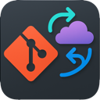

# VSCode autoGit Extension

<!--  -->


[](https://github.com/carlocardella/vscode-autogit/issues)
[](https://github.com/carlocardella/vscode-auto-git-extension/blob/master/LICENSE)
<!-- [](https://twitter.com/intent/tweet?text=Wow:&url=https%3A%2F%2Fgithub.com%2Fcarlocardella%2Fvscode-autogit) -->
<!-- [](https://open.vscode.dev/carlocardella/vscode-autogit) -->

[Download for VS Code](https://marketplace.visualstudio.com/items?itemName=CarloCardella.vscode-autogit)

<!-- [Download for VS Codium](https://open-vsx.org/extension/carlocardella/vscode-autogit) -->


<div align="left">
  
</div>

This extension automatically checks in changes to your local repository on file save and periodically pulls/pushes to your remote (GitHub, Azure Repos, Bitbucket, etc.).

<br>

## Features
- **Auto-commit on file save** (if enabled)
- **Auto-commit and sync of all pending changes on interval** (even if no file is saved; e.g. file deletions, renames, etc. are always committed)
- **Periodic pull/push to remote** (configurable interval, if enabled)
- **Sync on startup** (optional)
- **Sync after each commit** (optional)
- **Status bar indicator** shows if autoGit is enabled and when it is working (configurable)
- **Works with any git remote**
- **All features are disabled by default**; you must enable them in the settings
- **No errors if no remote is defined** (commits only, skips sync)
- **Status bar toggle** - Click the status bar item to enable or disable Auto Git instantly.
- **User-configurable debounce interval** for auto-commit after inactivity (default: 30 seconds)

## Extension Settings
- `vscode-autoGit.enabled` (boolean): If true, the extension will automatically commit and sync changes. If false, no git operations will be performed even if the extension is active.
- `vscode-autoGit.syncInterval` (number): Interval in minutes for periodic pull/push to the remote repository. Default: 10
- `vscode-autoGit.syncOnStartup` (boolean): If true, perform a git pull/push sync when the extension is activated, even if no file has been saved yet. Default: true
- `vscode-autoGit.syncAfterCommit` (boolean): If true, perform a git pull/push sync immediately after each auto-commit. Default: false
- `vscode-autoGit.statusBar` (boolean): Show a status bar indicator for Auto Git enabled/disabled state and working status. Default: true
- `vscode-autoGit.debounceIntervalSeconds` (number): Number of seconds of inactivity before auto-commit is triggered after editing a file. Default: 30, minimum: 5

## Requirements
- Git must be installed and available in your PATH
- A local git repository must already be initialized

## Usage
1. Install the extension (from VSIX or Marketplace).
2. Open your workspace/folder containing a git repository.
3. Go to Settings and search for "Auto Git" or "vscode-autoGit".
4. Enable `vscode-autoGit.enabled` and configure other options as desired.
5. Click the status bar item to quickly enable or disable Auto Git.

## How It Works
- On file save, all changes are staged and committed (if enabled).
- On the configured interval, **all pending changes** (including untracked, deleted, renamed, or updated files) are staged and committed, even if no file was saved. This ensures that actions like file deletions or renames are always committed and pushed.
- **AI-powered commit message generation** is attempted (using Copilot if available), using a rich prompt with file diffs and gitdoc-style instructions for more meaningful, semantic commit messages. If AI is unavailable, a descriptive fallback message is used listing all changed files.
- **Auto-commit after inactivity**: When editing, auto-commit is triggered only after a user-configurable period of inactivity (default: 30 seconds).

## Limitations
- Requires a local git repository.
- If no remote is defined, only local commits are made (no errors).

## Commit Message Generation

Auto Git attempts to use AI (Copilot) to generate a commit message for all staged changes. The prompt includes file diffs and detailed instructions to produce a concise, semantic summary of the changes (inspired by gitdoc). If unavailable, it falls back to a message like:

```
Auto-commit: <file1>, <file2>, ... at <timestamp>
```

## Release Notes

See [CHANGELOG.md](./CHANGELOG.md) for the full release history and details.

### Latest
- Extension package is now minimal: only strictly needed files are included in the VSIX for smaller size and faster install (v0.1.6).

---

**Credits:**
- Inspired by [GitDoc](https://github.com/lostintangent/gitdoc) and [AutoGit](https://github.com/Sonica-B/AutoGit/tree/main). This extension adapts and extends ideas from both projects, especially for AI-powered commit message generation and auto-commit workflows.
